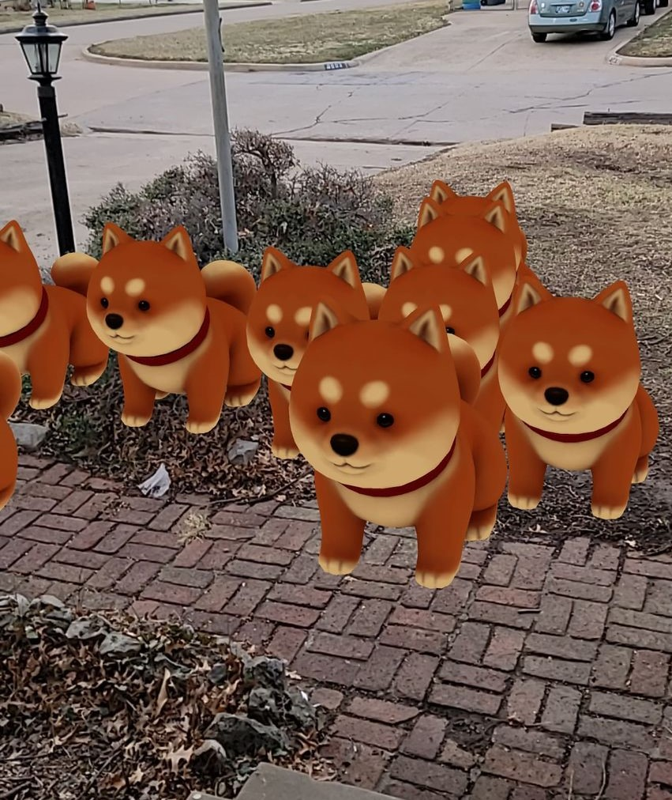

# Web_AR

## My first foray into the world of web AR. I'm a workhorse looking for a cart. This project was a good way to get started in the world of browser based AR before tackling the next major scene. My next goal with this project is to mobilize the puppy.

## The singular intent of this project is to place a model on an AR plane that is mapped to the real world.

## This project is mostly sourced through the [three.js library and resources](https://threejs.org/docs/index.html), which allows for the creation of 3D objects and planes.

## The process for using this repo is as simple as pointing and clicking. You will have to allow your phone to access your camera and your brain access to puppy-based joy.

## The model used is based on ["Shiba"](https://sketchfab.com/3d-models/shiba-faef9fe5ace445e7b2989d1c1ece361c) by [zixisun02](https://sketchfab.com/dogerlo) licensed under [CC-BY-4.0](http://creativecommons.org/licenses/by/4.0/)

[My LinkedIn](https://www.linkedin.com/in/deccaswell)
[My Portfolio](https://github.com/thisdoesntexistyet)
